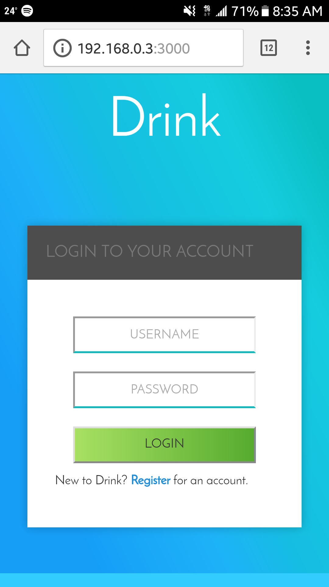
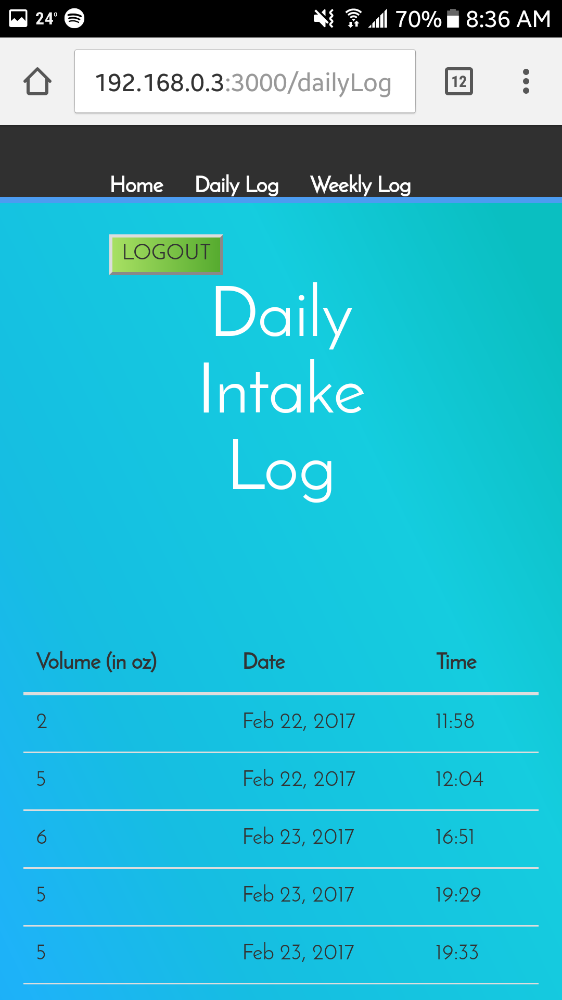
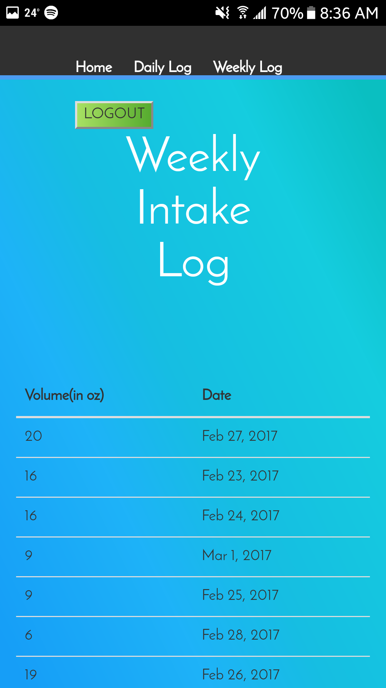

#Drink

**Author: Priscilla G**
**2/13/17**

**************************

This is my solo project for Prime Academy. Drink is an application to track daily and weekly water consumption. It integrates a Particle Photon to physically track how much water a user drinks per day.
***************************

On the home page, a user can manually add the amount of water they drank.

Any amount manually added on the home page or added from the "smart coaster" gets displayed here.

A user can see their total water intake for each day. 

***************************
Technologies used:

+MEAN stack

+Angularjs

+postgresSQL

+bcrypt

+node

+express

+particle api js

+passport-local
