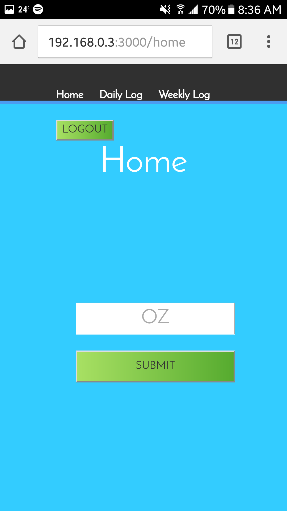

#Drink

**Author: Priscilla G**
**2/13/17**

**************************

This is my solo project for Prime Academy. Drink is an application to track daily and weekly water consumption. It integrates a Particle Photon to physically track how much water a user drinks per day.
***************************
{:height="250px" width="250px"}.

***************************
Technologies used:

+MEAN stack

+Angularjs

+postgresSQL

+bcrypt

+node

+express

+particle api js

+passport-local
